### `lucas@github ~ $ whoami`

### Olá, eu sou o Lucas Camy 👋

Desenvolvo produtos web de ponta a ponta, com atenção ao fluxo real de quem usa o sistema. Gosto de transformar operações complexas em interfaces claras, APIs confiáveis e dados que ajudam a decidir.

- **Frontend:** TypeScript, React, Next.js e interfaces responsivas.
- **Backend e dados:** C#, ASP.NET Core, APIs, PostgreSQL e integrações.
- **O que me move:** gestão, operações em campo, automação e experiência de uso.

Grande parte do meu trabalho acontece em repositórios privados. Um exemplo público é a [landing page demonstrativa para uma psicóloga](https://github.com/LucasCamy/presenca-landing-psicologa), construída com React e TypeScript, com conteúdo separado da interface e cuidados explícitos para não apresentar dados fictícios como reais.

### `lucas@github ~ $ ./atividade-publica.sh`

O gráfico mostra apenas contribuições públicas visíveis no GitHub e é atualizado automaticamente. O trabalho em repositórios privados pode não aparecer nele.

Visual inspirado no [perfil animado de Avi Vashishta](https://www.avivashishta.com/blog/build-animated-github-profile-readme).
